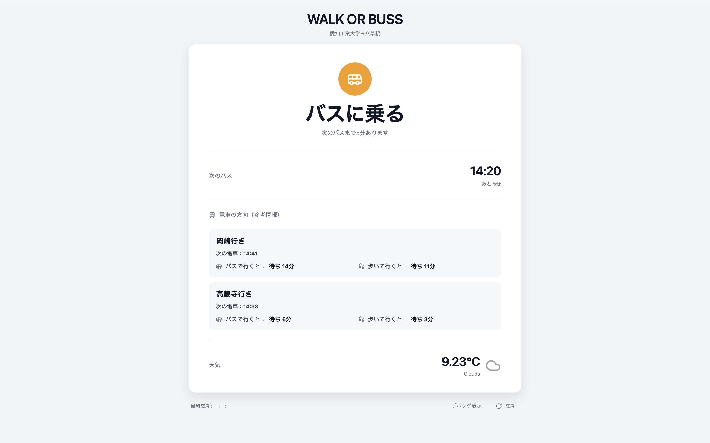

<p style="display: inline">


</p>

# WalkorBuss

本アプリは、愛知工業大学から八草駅までの移動において、
徒歩で向かうべきか、バスに乗るべきかを即座に判断してくれるWebアプリケーションです。<br>
バスの時刻などの情報を基に、その時点で最適な移動手段を自動で判定し、利用者に提示します。

## アピールポイント

- 単に次のバス時刻を表示するのではなく、**「今乗るべきか／歩くべきか」という判断結果を直接表示**します。
- 「情報を提示するアプリ」ではなく、「**判断を肩代わりするアプリ**」を目指して設計しました。
- **あえて画面遷移を行わず、起動直後に必要な判断結果が分かる**シンプルなUI設計にしています。


## 主な機能

- 次に来るバス時刻の取得 
- 次の電車時刻の取得 
- 豊田市の天気・気温の取得（OpenWeatherMap API） 
- 徒歩 or バスの最適手段の判定

## 実行画面


## 前提条件

### 必要なソフトウェア

- **Python 3.8 以上**（動作確認済み: Python 3.13）
- **pip**（Pythonパッケージマネージャー）

### 必要なAPIキー

- **OpenWeatherMap API Key**
  - 天気情報の取得に使用します
  - [OpenWeatherMap](https://openweathermap.org/api) で無料アカウントを作成し、APIキーを取得してください

## セットアップ

### 1. リポジトリのクローン

```bash
git clone <リポジトリURL>
cd WalkorBuss
```

### 2. 依存ライブラリのインストール

```bash
pip install -r requirements.txt
```

インストールされるライブラリ:
- Flask（Webフレームワーク）
- python-dotenv（環境変数管理）
- requests（HTTP通信）

### 3. 環境変数の設定

`.env.example` をコピーして `.env` ファイルを作成します。

```bash
cp .env.example .env
```

作成した `.env` ファイルを開き、APIキーを設定してください。

```bash
WEATHER_API_KEY=your_api_key_here  # ← ここを実際のAPIキーに置き換える
```

**APIキーの取得方法:**
1. [OpenWeatherMap](https://openweathermap.org/) にアクセス
2. アカウントを作成（無料）
3. ログイン後、右上の自身のユーザーネームをクリックし、メニューからMy API keys をクリックします。「API keys」タブからAPIキーをコピー
4. `.env` ファイルの `your_api_key_here` を取得したAPIキーに置き換え

## 使い方(実行方法)

### 1. アプリケーションを起動

```bash
python app.py
```

### 2. ブラウザでアクセス

アプリケーション起動後、以下のURLにアクセスしてください。


```
http://localhost:5000
```


### 3. 徒歩かバスかの推奨結果(実行画面)が表示されます

## 開発者の問い合わせ先
- 時刻表から、次に来るバスが何時のものかを出力,CSSの仕上げ<br>（担当： yusei-kubota URL： https://github.com/yusei-kubota ）
- 時刻表から、次に来る電車が何時のものかを出力,乗るor乗らない判断部分の作成<br>（担当：Ajdjduwvzkdjdhs URL： https://github.com/Ajdjduwvzkdjdhs ）
- プルリクの確認/マージ,judge.pyの修正<br>（担当： kopo-k URL： https://github.com/kopo-k ）
- APIで駅の現在の天気・気温を取得して配布、index.html,judge.pyの修正<br>（担当：Haruhisa222 URL： https://github.com/Haruhisa222 ）
- HTML,CSSでメイン画面を設計,APIと天気アイコン連結<br>（担当：kazuki404313 URL： https://github.com/kazuki404313 ）
